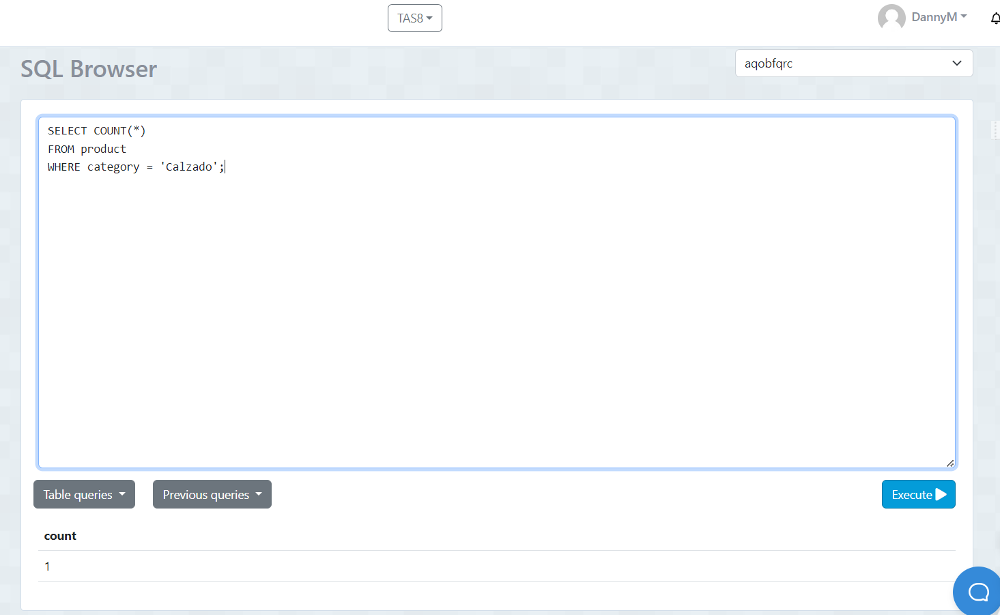
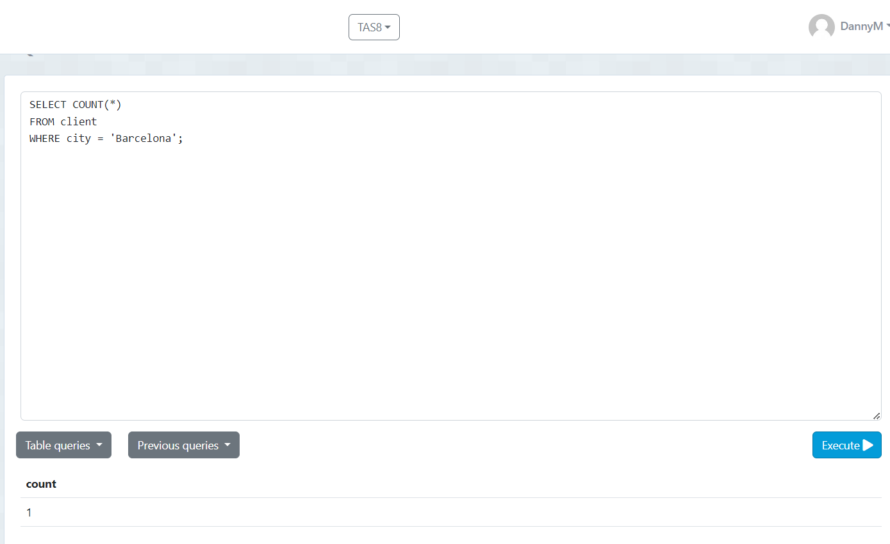
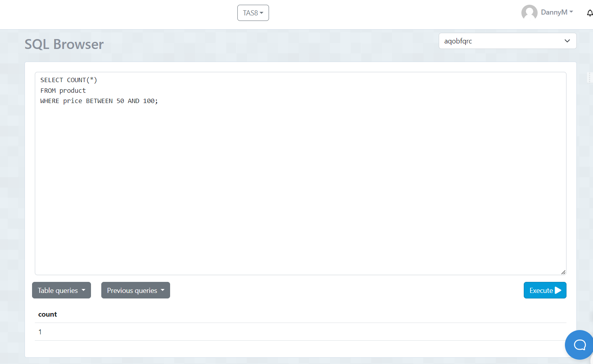
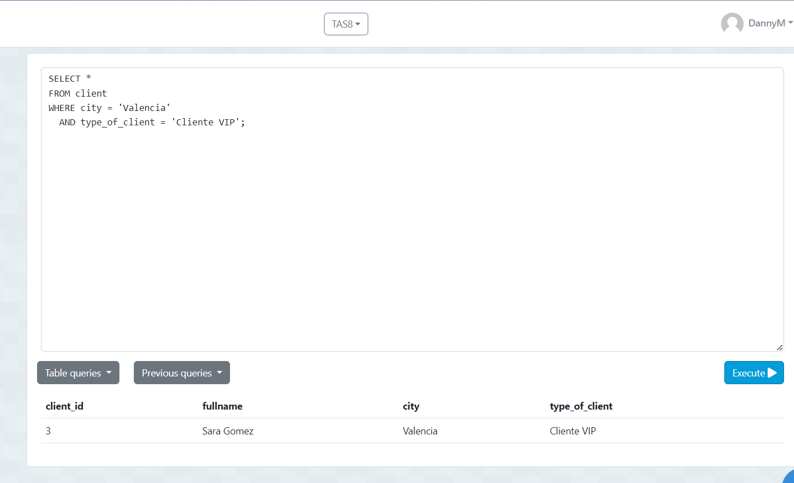
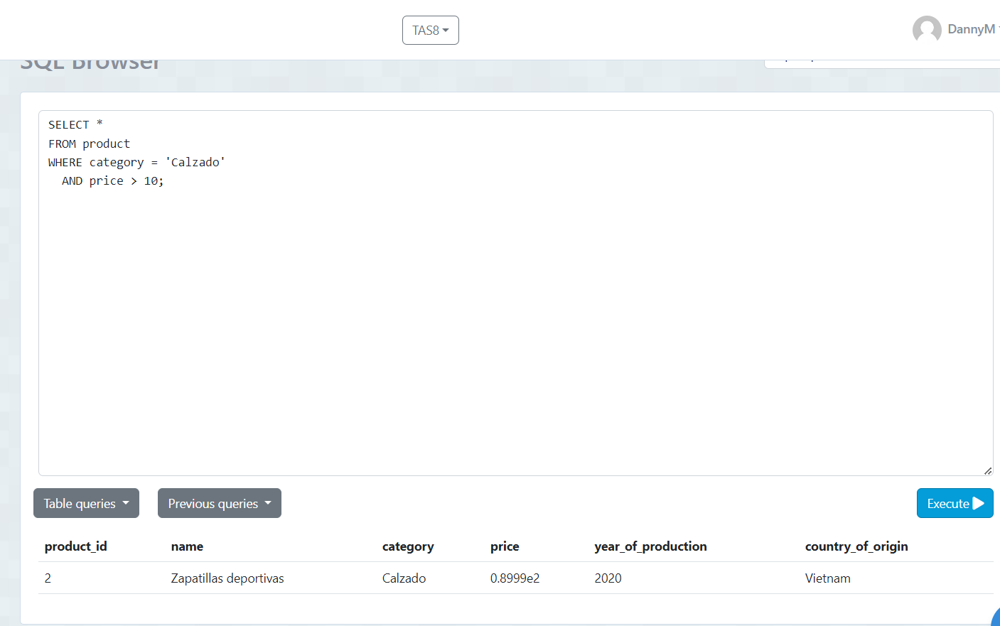
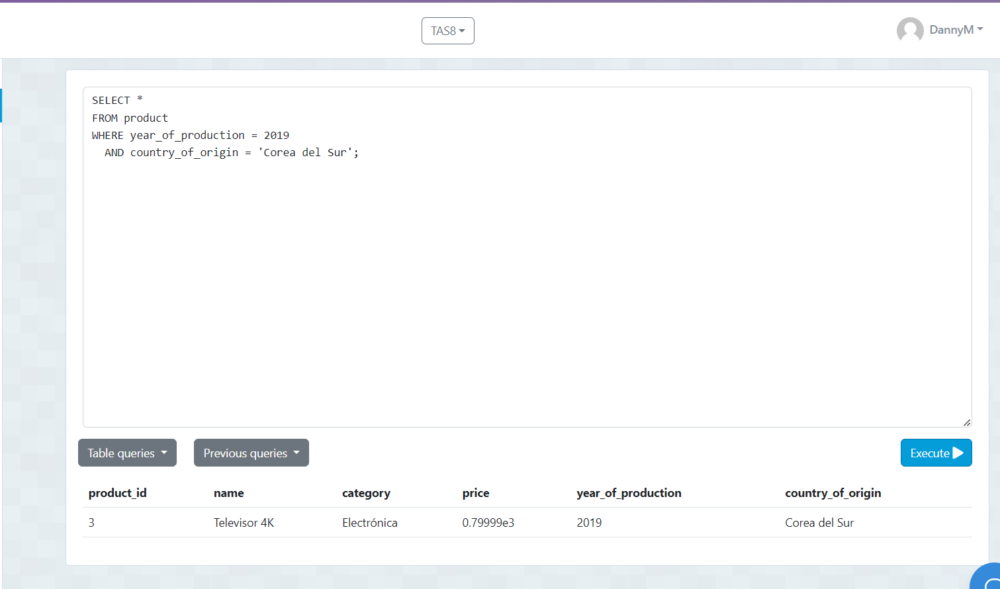
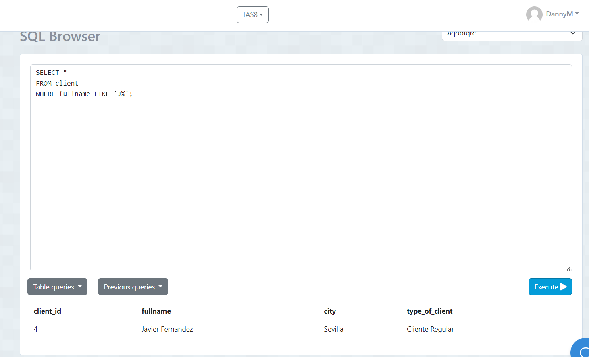
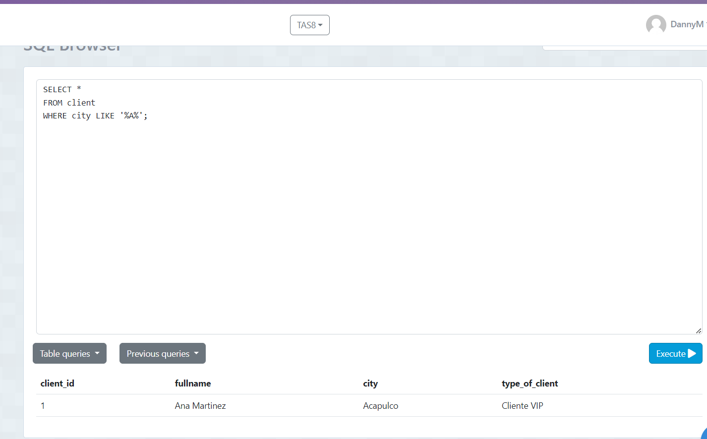

# TAS8 - Sentencias where multicriterio
## 1. Contar el número de productos de una categoría específica:

  - Sentencia:
  ```
 SELECT COUNT(*) 
 FROM product 
 WHERE category = 'Calzado';
  ```
- Captura:
  
 

## 2. Contar el número de clientes en una ciudad específica:


  - Sentencia:
  ```
 SELECT COUNT(*) 
 FROM client 
 WHERE city = 'Barcelona';
  ```
 - Captura:



## 3. Contar el número de productos cuyo precio está dentro de un rango específico:

  - Sentencia:
  ```
 SELECT COUNT(*) 
FROM product 
WHERE price BETWEEN valor_minimo AND valor_maximo;
  ```
- Captura:
  
 

## 4. Seleccionar clientes que viven en una ciudad específica y tienen un tipo de cliente específico:
 - Sentencia:
  ```
SELECT COUNT(*) 
FROM product 
WHERE price BETWEEN valor_minimo AND valor_maximo;
  ```
- Captura: 



## 5. Seleccionar productos que pertenecen a una categoría específica y cuyo precio está por encima de un valor específico:
 - Sentencia:
  ```
SELECT COUNT(*) 
FROM product 
WHERE price BETWEEN valor_minimo AND valor_maximo;
  ```
- Captura: 



## 6. Seleccionar productos que fueron producidos en un año específico y en un país de origen específico:
 - Sentencia:
  ```
SELECT * 
FROM product 
WHERE year_of_production = 2019 
AND country_of_origin = 'Corea del Sur';
  ```
- Captura: 



## 7.Seleccionar clientes cuyo nombre completo comience con 'J':

 - Sentencia:
  ```
SELECT * 
FROM product 
WHERE year_of_production = 2019 
AND country_of_origin = 'Corea del Sur';
  ```
- Captura: 



## 8.Seleccionar clientes cuya ciudad contenga la letra 'a':

 - Sentencia:
  ```
SELECT * 
FROM client 
WHERE city LIKE '%a%';
  ```
- Captura: 




 